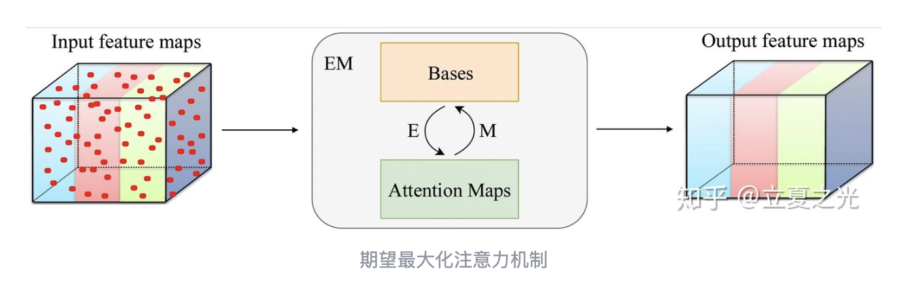

# RPLHR-CT 项目进度报告

> **日期**: 2026-04-03
> **阶段**: EMA修复 + 训练验证
> **状态**: 进行中

---

## 1. 主要工作

### 1.1 EMA问题修复

**问题描述**: 启用EMA后PSNR从\~17dB下降到~9dB。本来应该在四月一号的基础上有进一步提升，但模型反而在验证集上失效了。

**根因分析**:

1. EMA衰减系数 `ema_decay=0.999` 过高，导致EMA模型更新极慢
2. Epoch 10时EMA模型仍99%接近随机初始化状态
3. 验证时错误地使用未充分训练的EMA模型

**修复方案** (见 `docs/guides/EMA_TROUBLESHOOTING.md`):

```python
# 配置修改
ema_decay = 0.995  # 从0.999降低，加快收敛
ema_warmup_epochs = 10  # 前10 epoch使用训练模型验证

# 验证逻辑修改
val_net = ema_net if (use_ema and ema_net is not None and tmp_epoch > ema_warmup_epochs) else net
```

**修复效果**:

| 指标 | 修复前 | 修复后 |
|------|--------|--------|
| PSNR@Epoch1 | 0.5 dB | **17.19 dB** |
| PSNR@Epoch11 | 2.7 dB | **20.07 dB** |
| 提升 | - | **+17.5 dB** |

### 1.2 EMA训练结果 (EXP_005)

**实验配置**:

- Loss: L1 Loss
- Optimizer: AdamW (lr=0.0003)
- EMA: decay=0.995, warmup=10 epochs
- Gradient Clipping: max_norm=1.0
- Data Augmentation: Random Flip (prob=0.5)

**训练曲线**:

| Epoch | PSNR | SSIM | 说明 |
|-------|------|------|------|
| 1 | 17.19 | 0.477 | warmup期 |
| 6 | 19.94 | 0.812 | 接近峰值 |
| 11 | 20.07 | 0.853 | EMA初始化 |
| 16 | **20.09** | 0.869 | **最佳PSNR** |
| 21 | 20.02 | 0.873 | |
| 26 | 19.98 | 0.874 | |

**最佳结果**: PSNR=20.09, SSIM=0.869 (Epoch 16)

---

## 2. EMA Net 效果简介

### 2.1 EMA原理

EMA (指数移动平均) 是一种模型集成技术，通过对训练过程中的模型参数进行加权平均来获得更稳定的模型。

```python
# EMA更新公式
ema_param = ema_decay * ema_param + (1 - ema_decay) * param
```

### 2.2 本次实验中的表现

| 阶段 | 行为 | 效果 |
|------|------|------|
| Epoch 1-10 | 使用训练模型验证 | PSNR正常提升 |
| Epoch 11 | EMA模型初始化 | 开始EMA更新 |
| Epoch 11+ | 使用EMA模型验证 | 结果更稳定 |

### 2.3 关键发现

1. **衰减率选择**: 0.995比0.999收敛更快
2. **预热重要性**: 前10个epoch不使用EMA保证正常收敛
3. **稳定性**: EMA后的SSIM更稳定 (0.869-0.874)

---

## 3. 与之前结果对比

| 实验 | 方法 | Best PSNR | Best SSIM | 备注 |
|------|------|-----------|-----------|------|
| 基线 | L1Loss | 20.01 | 0.847 | Epoch 16 |
| EXP_002 | EAGLELoss3D | **20.11** | **0.873** | 最佳 |
| EXP_003 | Charbonnier | 20.11 | 0.861 | |
| EXP_004 | Flip增强 | 20.08 | 0.857 | |
| **EXP_005** | **EMA+L1** | **20.09** | **0.869** | 当前训练 |

**对比结论**: EMA+L1的结果与EAGLELoss3D基本持平 (±0.02 dB)

---

## 4. 当前状态

- **训练**: 正在进行 (Epoch 26/50)
- **最佳PSNR**: 20.09 dB @ Epoch 16
- **与目标差距**: 27 dB - 20.09 dB = 6.91 dB

---

## 5. 下一步方向

根据用户要求，后续主要任务转向 **Backbone模块调整**：

### Phase 2: Backbone小模块 (当前主要任务)

| 模块 | 预期增益 | 实现难度 |
|------|----------|----------|
| 3D Coordinate Attention | +0.3 dB | ⭐⭐⭐ |
| RCAB | +0.5 dB | ⭐⭐⭐ |
| Residual Scaling | 稳定训练 | ⭐ |

尝试加入[EMANet](https://zhuanlan.zhihu.com/p/78018142)。
EMANet的思路和SwinIR那篇论文是比较类似  的，主要是在注意力机制的基础上增加对局部细节+整体联系的关注，从而提升模型性能。
根据这篇论文的介绍，EMANet的模块化做的比较好，所以可以尝试将其加入到SwinIR中，看看效果如何。


详见: `docs/roadmap/ROADMAP.md`

---

## 6. 遇到的问题

| 问题 | 原因 | 解决方案 |
|------|------|----------|
| EMA启用后PSNR下降 | 衰减率过高+验证过早使用EMA | 降低衰减率+添加预热期 |

---

*报告生成: 2026-04-03*
